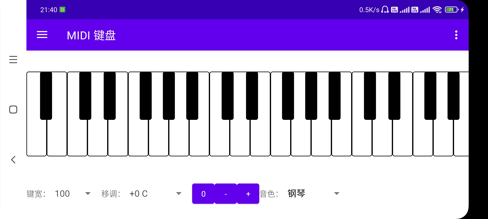

# 音乐工具

手机便携的音乐工具集合。

## 节拍器

根据指定的 BPM 节奏打拍子。BPM 可以通过滑条调节、直接输入、选择特定的速度名称，也可以直接通过录制键手工记录。

- 拉动滑条或手动填入 BPM 数字
- 按播放键开始打节拍
- 预设常见的节拍名称
- 以较稳定的频率按记录键，可以记录下按键的频率，按重置记录键可以开启新一轮记录
- BPM 允许的范围为20~220

## MIDI 键盘

便携的 88 键钢琴键盘。竖屏显示双行键盘，横屏显示单行键盘，可调节键盘的键宽，快速进行半音移调，切换音色。

- 竖屏为双排、横屏为单排键盘
- 可选择键宽大小
- 可通过下拉菜单进行快速移调，或者通过加减按钮半音移调，通过0按钮将移调归零
- 可以选择不同的合成音色

